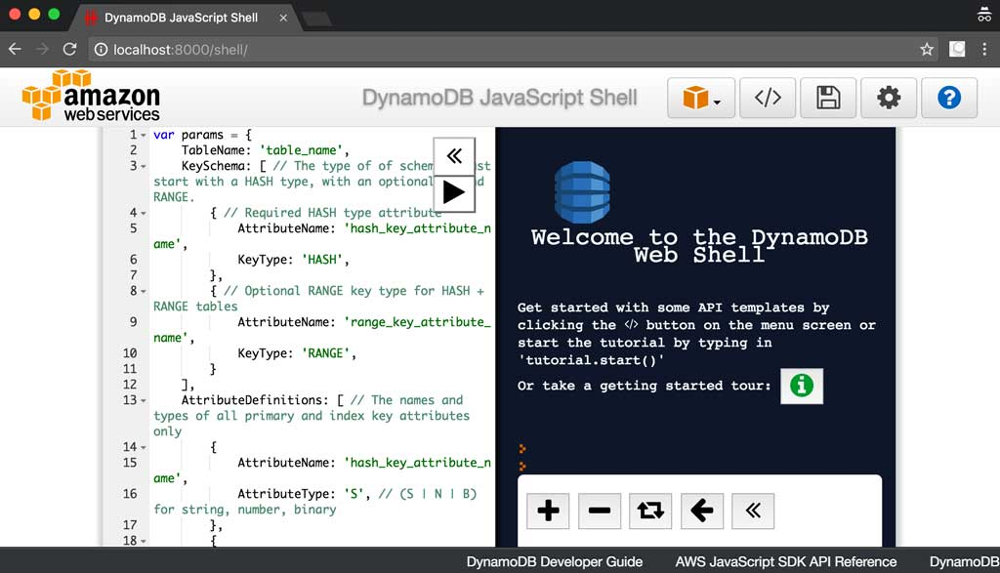

# docker-dynamodb

[](https://circleci.com/gh/dwmkerr/docker-dynamodb) [](https://imagelayers.io/?images=dwmkerr/dynamodb:latest 'Get your own badge on imagelayers.io') [](https://www.guardrails.io)

[](https://registry.hub.docker.com/u/dwmkerr/dynamodb/)

Run DynamoDB locally with Docker:

```bash
docker run -p 8000:8000 dwmkerr/dynamodb
open http://localhost:8000/shell
```



This container has full support for all of the commandline parameters in the [DynamoDB Documentation](http://docs.aws.amazon.com/amazondynamodb/latest/developerguide/DynamoDBLocal.html).

Note - there is now an Official AWS Docker Image for DynamoDB:

 - [AWS Blog: Use Amazon DynamoDB Local More Easily with the New Docker Image](https://aws.amazon.com/about-aws/whats-new/2018/08/use-amazon-dynamodb-local-more-easily-with-the-new-docker-image/)
 - [Docker Hub: DynamoDB](https://hub.docker.com/r/amazon/dynamodb-local/)


<!-- vim-markdown-toc GFM -->

* [Instructions](#instructions)
* [Coding](#coding)
    * [The Dockerfile](#the-dockerfile)
    * [The Makefile](#the-makefile)
    * [The Tests](#the-tests)
* [Continuous Integration](#continuous-integration)
* [Samples](#samples)
    * [Generating an Image with Test Data](#generating-an-image-with-test-data)
    * [Connecting an AWS Lambda Function against a local Database](#connecting-an-aws-lambda-function-against-a-local-database)
* [Troubleshooting](#troubleshooting)
* [Contributing](#contributing)

<!-- vim-markdown-toc -->

# Instructions

To run an ephemeral instance of DynamoDB:

```bash
docker run -p 8000:8000 dwmkerr/dynamodb
```

If you want to have persistent data, just mount a volume from your host and set it as a data directory for DynamoDB:

```bash
docker run -v /data:/data -p 8000:8000 dwmkerr/dynamodb -dbPath /data
```

If you want to access tables and data created by the AWS CLI through a language SDK (Node, Java, etc), you will want to use the `-sharedDb` option [as described in this AWS forum post](https://forums.aws.amazon.com/thread.jspa?messageID=717048):

```bash
docker run -p 8000:8000 dwmkerr/dynamodb -sharedDb
```

Without this option, each connection will get is own database and the data will not be accessible between different clients.

# Coding

The code is structured like this:

```
Dockerfile     # the important thing, the actual dockerfile
makefile       # commands to build, test deploy etc
tests/         # bash scripts to test how the container works
```

## The Dockerfile

The Dockerfile is based on [OpenJDK](https://hub.docker.com/_/openjdk/) and essentially just runs a jar file in a JRSE 7 environment.

## The Makefile

The makefile contains commands to build, test and deploy. Parameters can be passed as environment variables or through the commandline.

| Command                  | Notes                             |
|--------------------------|-----------------------------------|
| `make build`             | Builds the image `dwmkerr/dynamodb:latest`. If a `BUILD_NUM` parameter is provided, also builds `dwmkerr/dynamodb:BUILD_NUM`. |
| `make test`              | Runs the test scripts. |
| `make deploy`            | Deploys the images to the docker hub. If you are not logged in, you're gonna have a bad time. |

## The Tests

The tests are simple bash scripts which check for basic capabilties *which relate to the image*. This means they're not there to make sure DynamoDB Local works, they're there to make sure the docker features work with the image. For example, mounting a volume to provide a persistent data directory.

# Continuous Integration

CI is provided currently by Circle. Ensure you provide AWS credentials as we are using the AWS CLI (they are not used, but the CLI still checks that they are present).

# Samples

## Generating an Image with Test Data

A basic sample showing how to build an image with custom test data is at [`./samples/test-data`](./samples/test-data).

1. Go to the sample: `cd ./samples/test-data`
2. Create some sample data: `make create-test-data`. This creates sample data files at `./data`.
3. Build a new docker image called `sample-test-data`, with `make build`.
4. The newly created image has the test data built in. Verify with `make test`.

## Connecting an AWS Lambda Function against a local Database

There's a great blog post on this here:

https://thebitmuncher.home.blog/2019/03/01/how-to-connect-to-local-dynamodb-on-docker-from-local-aws-sam-lambda-node-js-function/

# Troubleshooting

**Missing required key 'ProvisionedThroughput' in params Unexpected key 'BillingMode' found in params**

The issue is the underlying DynamoDB Local jar provided by AWS requires read and write capacity units to be specified (https://docs.aws.amazon.com/amazondynamodb/latest/developerguide/DynamoDBLocal.UsageNotes.html).

Provisioned throughput settings are ignored in downloadable DynamoDB, even though the CreateTable operation requires them. For CreateTable, you can specify any numbers you want for provisioned read and write throughput, even though these numbers are not used. You can call UpdateTable as many times as you want per day. However, any changes to provisioned throughput values are ignored.

Here is an example CreateTable call which will work:

```js
// Note we have to specify ProvisionedThroughput, but it will not be used.
var params = {
    TableName: 'table',
    ProvisionedThroughput: {
        ReadCapacityUnits: 1,
        WriteCapacityUnits: 1
    },
    KeySchema: [
        {
            AttributeName: 'id',
            KeyType: 'HASH',
        }
    ],
    AttributeDefinitions: [
        {
            AttributeName: 'id',
            AttributeType: 'S',
        }
    ],
};
dynamodb.createTable(params, function(err, data) {
    if (err) ppJson(err); // an error occurred
    else ppJson(data); // successful response

});
```

# Contributing

Please help out! Here are some areas I'd like to improve upon:

- [ ] Cleaner or colourised output for the tests. Is there any simple tool to do assets in a shell script?

If you contribute, include a `README.md` update in your PR and I'll list your contributions here.
